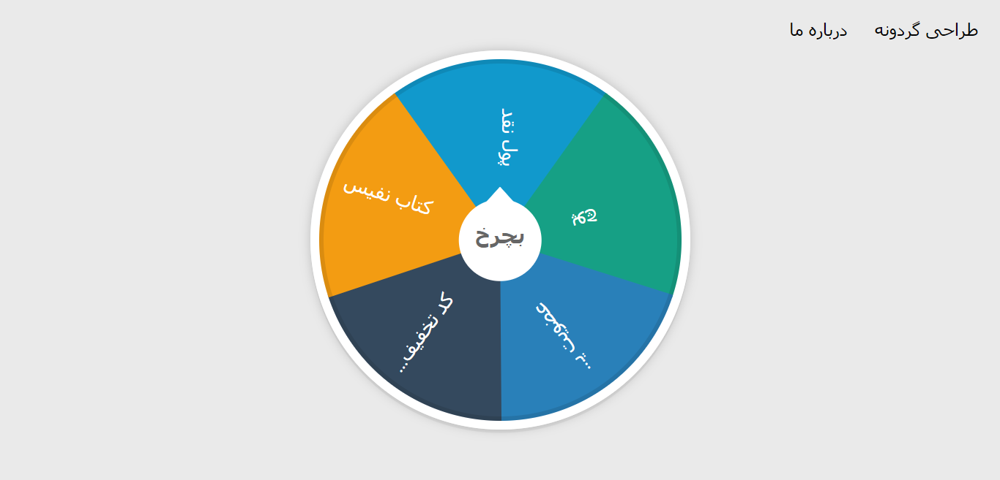
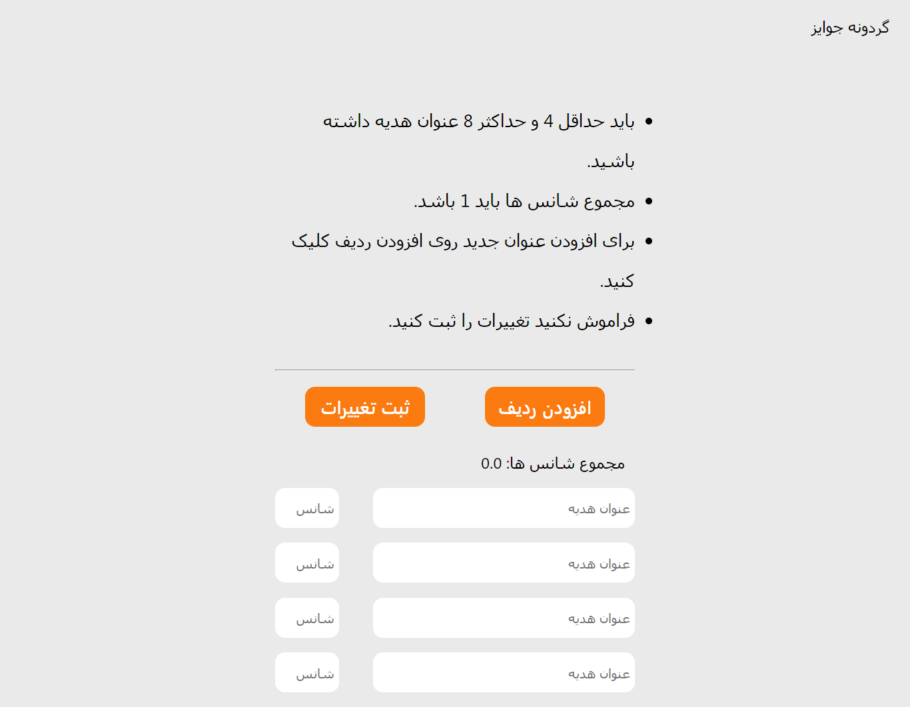

# Prize wheel
> By clicking on the "Spin" button, the wheel spins and the user's reward is determined. Each user can spin the wheel only once in a specified period of time. This time interval is one hour by default and can be changed by the administrator.




## Setup
1. Clone this repo in your local dir.

2. Head to repo dir, then in your terminal:
```sh
npm install
```

3. then start your server
```sh
npm start
```
or
```sh
node index.js
```
or if in development: `npm run dev`

Go to: `localhost:3040` to take a SHOT!

## Features

- Change Slice titles and make new slice up to 8
- Change the probability of each slice
- Prevent the wheel turning after the user's first action until a specified time
- Get usernames and use in alerts
- It's Responsive

## Features (coming soon)

- Log in to change the wheel (private design panel)
- Send prize title to client via SMS
- Export list of all users and their prizes


## Packages and technologies

- Node.js
- JavaScript
- HTML5 + CSS3
- Express
- Nedb (a open source no-sql database)
- dotenv


## Design panel



